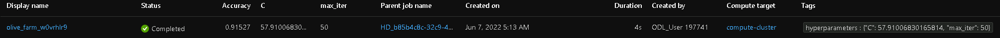
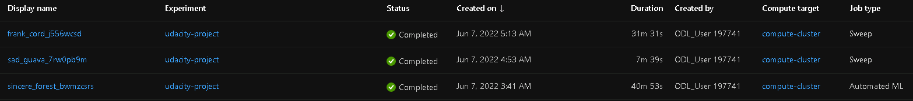
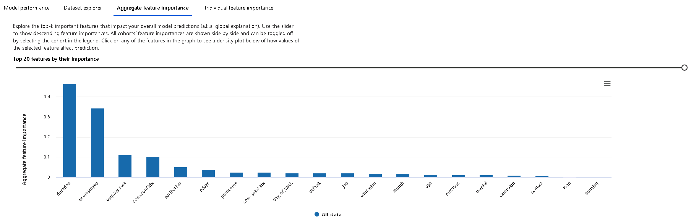
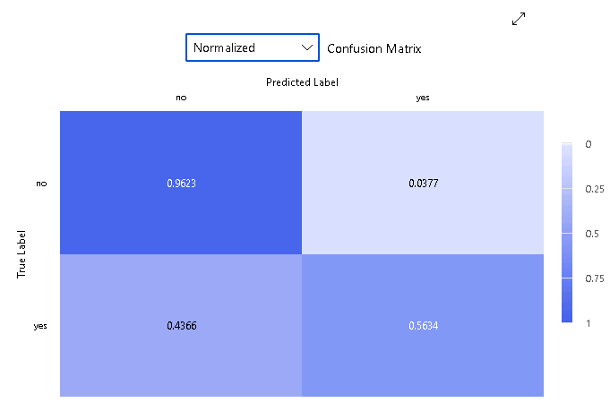

# Optimizing an ML Pipeline in Azure

## Overview
This project is part of the Udacity Azure ML Nanodegree.
In this project, we build and optimize an Azure ML pipeline using the Python SDK and a provided Scikit-learn model.
This model is then compared to an Azure AutoML run.

## Useful Resources
- [ScriptRunConfig Class](https://docs.microsoft.com/en-us/python/api/azureml-core/azureml.core.scriptrunconfig?view=azure-ml-py)
- [Configure and submit training runs](https://docs.microsoft.com/en-us/azure/machine-learning/how-to-set-up-training-targets)
- [HyperDriveConfig Class](https://docs.microsoft.com/en-us/python/api/azureml-train-core/azureml.train.hyperdrive.hyperdriveconfig?view=azure-ml-py)
- [How to tune hyperparamters](https://docs.microsoft.com/en-us/azure/machine-learning/how-to-tune-hyperparameters)

## Summary
### Problem Statement
The goal of this project is to train a binary classification model to identify if a client will subscribe to a term deposit with the bank based on the UCI Bank Marketing dataset. This dataset contains information about clients including their age, job, marital status, and education.

### Solution
In order to find a solution, a number of models were generated through two main processes: AzureML HyperDrive and Microsoft's automated machine learning offering, AutoML. Of the 36 LogisticRegression models generated by HyperDrive, the best performing model had an accuracy of 91.527%, whereas the best AutoML model was a VotingEnsemble with an accuracy of 91.763%.

## Scikit-learn Pipeline
This pipeline contains 3 main components: dataset, the `train.py` script, and the Jupyter Notebook containing the pipeline orchestration.

The data is first loaded into the project as a `TabularDataset` through the `TabularDatasetFactory` before being prepared.

The `train.py` script contains the logic to preprocess the data before it can be used for training a model. This includes one-hot encoding of months, weekdays, and other categorical fields, as well as binary encoding for fields containing a `yes` or `no` value.

Once the preprocessing is complete, the data can be split into training and testing sets and the `LogisticRegression` model can be trained with scikit-learn by passing it a value for "Regularization Strength" (`C`) and "Max Iterations" (`max_iter`). In order to optimize these hyperparameters, I used `RandomParameterSampling` as a parameter sampler in the HyperDrive config, which randomly selects values for `C` and `max_iter` for each run. For `C`, a random float between 0.1 and 100.0 was selected, while for `max_iter`, a random value of either 10, 50, 100, 250, 500, or 1000 was selected. By using random sampling, multiple models can be trained and tested with a variety of different hyperparameters across a range of values, resulting in a high-performing model without being very resource-intensive, as we would see with grid sampling.

A `BanditPolicy` with a `slack_factor` of 0.1 as an early termination policy also gets set in the HyperDrive config. This allows for the termination of any model that with an accuracy below (1 / (1 + 0.1)), or 91%, of the best performing run, thus avoiding unnecessarily wasting resources on a poor-performing run.

The HyperDrive config also contains the primary metric to use as a basis for evaluating what the "best" model is. In this case, the goal was to maximize the accuracy of the model for each run. From the 36 runs in this pipeline, the best `LogisticRegression` model had an accuracy of 91.527% with `C ≈ 57.91` and `max_iter = 50`.

## AutoML
The AutoML pipeline resulted in 32 runs using varying algorithms and hyperparameters. The best performing run resulted in a `VotingEnsemble` model whose hyperparameter was `algorithm: ['LightGBM', 'XGBoostClassifier', 'XGBoostClassifier', 'XGBoostClassifier', 'LightGBM', 'XGBoostClassifier', 'LogisticRegression', 'SGD']` with an accuracy of 91.763%.

## Pipeline comparison
The overall performance of the models was comparable with only a 0.263% increase in accuracy for the Voting Ensemble model generated with AutoML versus the Logistic Regression trained with HyperDrive. In terms of time, the AutoML pipeline took almost 41 minutes to complete 32 runs, whereas the HyperDrive pipeline took 31 minutes to complete 36 runs, as seen in the image below (note that the middle run is another HyperDrive run I ran with only 6 models).

While HyperDrive gives you more control of the training process by having you provide the training script and specify parameter sampling and early termination policies, AutoML is quick and easy to configure by simply providing a few configuration values. AutoML's model also gives an explanation, showing things like feature importance and plots of data points to help better understand the resulting model as opposed to simply being a black box.

## Future work
If this experiment were to be repeated in the future, one thing to consider would be allowing for more than 30 minutes for the `experiment_timeout_minutes` for AutoML as this could also have resulted in a better model given more time to train the models. In the same realm of this, I would also generate more models with a wider range of hyperparameter values for the HyperDrive pipeline to see if a better combination of hyperparameters could be found. I would also consider using a different sampler if compute resources were less of an issue, such as grid sampling or bayesian sampling.

Another aspect to consider would be finding a way to improve the data as this dataset was very unbalanced. This dataset has vastly more instances where a client did not subscribe to a term deposit with the bank compared to those who did, with only 3692 clients who did versus the 29258 clients who did not. A more balanced dataset could result in a better performing model as it would be less biased, seen in the normalized confusion matrix where 43.66% of the true `yes` labels were false negatives, whereas only 3.77% of the `no` labels were false positives.

